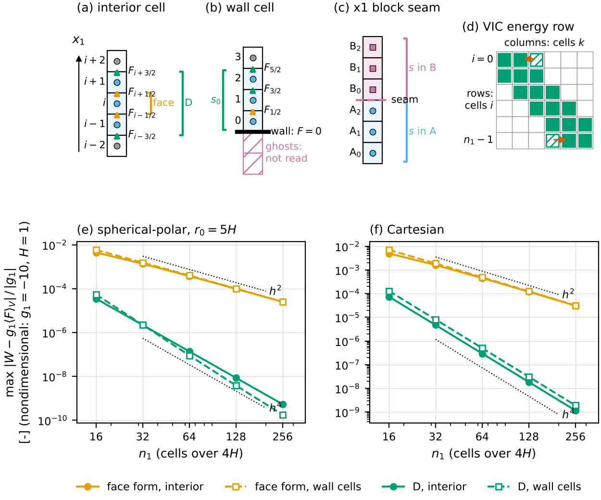

# 6.4 The corrected-PE face gravity work (`SNAP_GRAVITY_WORK_RADIAL_EXACT`, "scheme D")

> Pinned sha: snapy@dae902b (`next/final-batch` on UCzhangxi/snapy; snapy main `aea71ed` plus the gravity-work
> round). Derivation sources: `docs/derivations/curved-gravity-work-weight.md@dae902b` §§1-4, 7, 8, 10, 11
> (copy: `sources/deriv__curved-gravity-work-weight.md`, which predates §11 and the seam paragraph of §7);
> `sources/gw__NEXTPR_legD_REPORT.md`; `sources/gh__PR_BODIES_285-293.md`. Executable check:
> `checks/d_face_work_pe_check.py` (11 claims, all pass; output `checks/d_face_work_pe_check.out`).
> Figure: `figures/fig_D_face_work_pe.py`. Status: draft (round 1, the model section; revised after one review).

Read first: §6.1 (the cell form of the gravity work), §6.2 (the face form) and §6.3 (the gravity-work fixer). This
section uses the notation of `NOTATION.md` §§1, 4, 5 and 7.

**Units.** $g_1$ [m s$^{-2}$], $\rho$ [kg m$^{-3}$], $F$ [kg m$^{-2}$ s$^{-1}$], $h$ and $x_1$ [m], $\sigma^2$ [m$^2$],
$\phi$ [m$^2$ s$^{-2}$], $W$ [W m$^{-3}$]. $E$, $\mathrm{PE}_d$ and $P$ are in J. In the column forms below they are
per unit horizontal area (Cartesian) or per steradian (spherical-polar). The executable check is nondimensional, with
$g_1=-10$ and scale height $H=1$.

**Local symbols** (flagged for `NOTATION.md`): the stencil set $\mathcal N_i$, with stencil cells indexed by $l$; the
slope matrix $\mathsf S_{il}$ (row $i$ holds the weights of cells $l$ in the slope of cell $i$); $\Delta t_c$, the time
step handed to the implicit solve; $\delta E_i$, the energy component of $\boldsymbol\delta_i$; $\lambda_w$, a
wavelength.

---

## 1. Summary

**What it does.** With `gravity-work: face`, snapy books the energy that gravity exchanges with the flow, the gravity
work, in the form of a flux difference of potential energy across each cell's $x_1$ faces (the face form, §6.2).
Scheme D adds one term to that work in every cell,
$$W^{\rm D}_i = W^{\rm face}_i + g_1\,\sigma_i^2\,s_i[\dot\rho],$$
where $\dot\rho$ is the stage's $x_1$ density tendency, $s_i$ the slope of the quadratic through cell $i$ and its two
$x_1$ neighbours, and $\sigma_i^2$ the variance of $x_1$ over the cell. The added term is the work done by moving
the mass of a cell whose density is not uniform inside it.

**Why it is there.** The face form conserves total energy $E$ plus the discrete potential energy
$\mathrm{PE}_d=\sum_iV_i\bar\rho_i\phi_i$ exactly, but $\mathrm{PE}_d$ is itself only a second-order approximation of
the true potential energy of the cell averages. The face form therefore books a gravity work with an $O(h^2)$ error
in every cell: the trapezoid term $\tfrac{h^2}{12}F''$, plus two $O(h^2/r)$ curvature terms on spherical-polar grids.
The cp3/cp5/weno5 reconstructions remove part of it with the curvature flux $\mathcal K$ (§6.2), but that flux is
zero at walls, which leaves the two wall cells of every column first order. Scheme D replaces $\mathrm{PE}_d$ by a
fourth-order potential energy $P$ and books exactly the work that conserves $E+P$. The result is:
- a gravity work that is $O(h^4)$ relative to the exact work of the scheme's own $x_1$ mass fluxes, in every cell,
  the wall cells included. This is measured on uniform Cartesian and spherical-polar grids; smoothly stretched grids
  follow by the same argument. It makes the gravity work consistent with the mass fluxes to fourth order. It does
  not make the energy equation fourth order: the fluxes $F_{i\pm1/2}$ keep the reconstruction's and the Riemann
  solver's error;
- $E+P$ conserved to round-off on a closed column, in every RK stage, explicit and implicit (VIC).

**When it is on.**
- Environment variable `SNAP_GRAVITY_WORK_RADIAL_EXACT`, read once per process. It is **on unless set to `0`,
  `false`, `off` or `no`** (case-insensitive). It acts only where all of these hold:
  - `forcing/const-gravity/gravity-work: face`. Not `cell` (the YAML default) and not `face-wallc`;
  - `grav1` $\neq 0$;
  - geometry `cartesian` or `spherical-polar`. These first three conditions are `radial_exact_work()`;
  - the $x_1$ flux is computed (`disable_flux_x1` false);
  - the block has $n_1\ge3$ cells in $x_1$ (for fewer the slope is zero and the matrix coupling is skipped).

  So the default run (`gravity-work: cell`) is unaffected, and **every `gravity-work: face` run on a Cartesian or
  spherical-polar grid uses D unless it is switched off.**
- On a `gnomonic-equiangle` (cubed-sphere) grid with `gravity-work: face` the switch has no form. Setup warns once
  and the plain face work is kept.
- Couplings:
  - With D active the cp3/cp5/weno5 curvature flux $\mathcal K$ is turned off. D already removes the term
    $\mathcal K$ removes, and the two together are back to $O(h^2)$.
  - D and the gravity-work fixer (§6.3) never meet: the fixer runs only with `gravity-work: cell`.
  - With an implicit scheme (`implicit-scheme` $\neq 0$), part of D is booked inside the vertical implicit operator
    (§2.10). The face form is booked there too (chengcli/snapy#283). An implicit scheme requires one block in $x_1$.
- With D on, the conserved invariant is $E+P$, not $E+\mathrm{PE}_d$. The cycle diagnostics log $P$ as `pe=`. Every
  $E+\mathrm{PE}_d$ check, including `gravity_work_defect()`, measures the wrong quantity.

**Aliases.**
- "Leg D" of the gravity-work round, hence "scheme D" in this report.
- "Option F" in `curved-gravity-work-weight.md` §7. That note's "option D" is a different, rejected two-point
  weight; do not confuse the two.
- "Corrected-PE work", and "radial-exact" in identifiers.
- History: the implicit part was moved into the VIC operator by snapy@f256ab5 (its subject cites #296, which is
  not a PR on UCzhangxi/snapy and is taken to be chengcli/snapy#296; to confirm), and D was made the default with
  `gravity-work: face` by snapy@84b037f.

---

## 2. Derivation

Every closed form in this layer is checked by `checks/d_face_work_pe_check.py`; the claim tags `[Cn]` point at
its output lines. Every [Cn] number has the same provenance: [sha: the formulas of snapy@dae902b, ported line for
line; deck: the check itself; run: `python3 checks/d_face_work_pe_check.py`, numpy 2.5.3, sympy 1.14.0, double].
Fitted orders use the last three resolutions ($n_1$ = 64, 128, 256) unless stated.

### 2.1 The continuous budget

With constant gravity $g_1$ along $x_1$, mass and total energy obey
$$\partial_t\rho + \nabla\cdot(\rho\mathbf v) = 0,\qquad
\partial_tE + \nabla\cdot\big[(E+p)\mathbf v\big] = \rho v_1g_1. \tag{6.4.1}$$
The $x_2$, $x_3$ components of gravity book cell work only (§6.1) and play no part here. The potential
$\phi(x_1) = -g_1x_1$ does not depend on time, and $\rho v_1g_1 = -\rho\mathbf v\cdot\nabla\phi$, so
$$\partial_t(E+\rho\phi) + \nabla\cdot\big[(E+p+\rho\phi)\mathbf v\big] = 0. \tag{6.4.2}$$
$E+\rho\phi$ is conserved. In a closed domain $\int(E+\rho\phi)\,dV$ is constant.

### 2.2 The exact work in one cell

Integrate the gravity source over cell $i$ and write the $x_1$ mass flux density as $F=\rho v_1$:
$$\int_{V_i}\rho v_1g_1\,dV = g_1V_i\langle F\rangle_{V_i}.$$
Now multiply the continuity equation by $\phi$ and integrate over the cell. Use
$\phi\,\nabla\cdot(\rho\mathbf v) = \nabla\cdot(\phi\rho\mathbf v) - \rho\mathbf v\cdot\nabla\phi$ and the divergence
theorem. Keep only the $x_1$ faces: on Cartesian and spherical-polar grids the $x_2$, $x_3$ faces lie on surfaces of
constant $\phi$, so their terms are mass fluxes times one value of $\phi$, which §2.9 treats. Then
$$\frac{d}{dt}\int_{V_i}\rho\phi\,dV = -\Delta_i[A\phi F] - g_1V_i\langle F\rangle_{V_i}.$$
Rearranged, the exact gravity work in a cell is
$$g_1V_i\langle F\rangle_{V_i} = -\frac{d}{dt}\mathcal P_i - \Delta_i[A\phi F],\qquad
\mathcal P_i = \int_{V_i}\rho\phi\,dV. \tag{6.4.3}$$
(6.4.3) is the template for every scheme in this chapter. Pick any discrete potential energy $P=\sum_iP_i$ and
**define** the booked work by
$$W_iV_i := -\dot P_i - \Delta_i[A\phi F], \tag{6.4.4}$$
with $\dot P_i$ evaluated on the discrete density tendency. Two properties follow at once:
- **Conservation.** Summing (6.4.4) over a column, the $\Delta_i$ terms telescope to the two walls, where $F=0$:
  $\sum_iW_iV_i + \dot P = 0$. The other energy fluxes telescope too, so $E+P$ is conserved exactly, whatever
  $P$ is.
- **Accuracy.** Subtracting (6.4.4) from (6.4.3) gives $W_iV_i - g_1V_i\langle F\rangle_{V_i} =
  \tfrac{d}{dt}(\mathcal P_i - P_i)$. The booked work is exactly as accurate as $P_i$ is as an approximation of the
  cell's potential energy.

So the whole design problem is to choose a $P_i$ that is accurate and computable from cell averages.

### 2.3 The face form is $P = \mathrm{PE}_d$

The discrete continuity equation in $x_1$ is
$$V_i\dot\rho_i = -\Delta_i[AF], \tag{6.4.5}$$
with $F_{i\pm1/2}$ the total mass flux density the Riemann solver returns (dry plus every mass-carrying species,
after the positivity limiter and sedimentation). Take $P_i = V_i\bar\rho_i\phi_i$ with $\phi_i=\phi(x_{1,i})$ at the
volume centroid. Then $\dot P_i = V_i\dot\rho_i\phi_i = -\phi_i\Delta_i[AF]$ and (6.4.4) gives
$$W^{\rm face}_i = \frac{1}{V_i}\Big[\phi_i\,\Delta_i[AF] - \Delta_i[A\phi F]\Big]
= \frac{g_1}{V_i}\Big[(x_{1,i+1/2}-x_{1,i})A_{i+1/2}F_{i+1/2} + (x_{1,i}-x_{1,i-1/2})A_{i-1/2}F_{i-1/2}\Big],
\tag{6.4.6}$$
the second form from $\phi_i - \phi_{i\pm1/2} = g_1(x_{1,i\pm1/2}-x_{1,i})$. Code:
`src/hydro/hydro_forward.cpp:818-820@dae902b` (times $\Delta t$). The face form conserves $E+\mathrm{PE}_d$ exactly,
by §2.2.

*Its error.* $\mathrm{PE}_d$ is the exact $\int\rho\phi\,dV$ of a piecewise-constant density, so it misses the
in-cell density gradient (§2.4). On a uniform Cartesian grid (6.4.6) is the trapezoid rule,
$W^{\rm face}_i = g_1(F_{i+1/2}+F_{i-1/2})/2$, with error $g_1\tfrac{h^2}{12}F''$ in every cell. On a
spherical-polar grid two more terms appear (`curved-gravity-work-weight.md` §2, eq. 2):
$$\frac{W^{\rm face}_i - g_1\langle F\rangle_{V_i}}{g_1} = \frac{h^2}{12}F'' + \frac{h^2}{6\bar r}F' - \frac{h^2}{6\bar r^2}F
+ O(h^4). \tag{6.4.7}$$
[C6] measures the face form at second order in interior and wall cells on both grids.

### 2.4 The potential energy of a cell to fourth order

Let $\rho(x_1)$ be smooth inside cell $i$ and expand it about the centroid $x_{1,i}$:
$\rho = \rho(x_{1,i}) + \rho'\,(x_1-x_{1,i}) + \tfrac12\rho''(x_1-x_{1,i})^2 + \tfrac16\rho'''(x_1-x_{1,i})^3 + \dots$,
with the derivatives taken at $x_{1,i}$. With $\phi = -g_1x_1$,
$$\mathcal P_i = -g_1\int_{V_i}\rho\,x_1\,dV = -g_1\Big[x_{1,i}\int_{V_i}\rho\,dV + \int_{V_i}\rho\,(x_1-x_{1,i})\,dV\Big].$$
The first integral is $V_i\bar\rho_i$ exactly, with $\bar\rho_i$ the cell average, so the first term is
$V_i\bar\rho_i\phi_i$. In the second, the centroid makes the first moment vanish,
$\int_{V_i}(x_1-x_{1,i})\,dV=0$. The remaining moments are:
- the second, $V_i\sigma_i^2$ with $\sigma_i^2 = \langle(x_1-x_{1,i})^2\rangle_{V_i}$;
- the third, zero on a Cartesian grid and $O(h^4/r)\,V_i$ on spherical-polar;
- the fourth, $O(h^4)V_i$.

Hence
$$\mathcal P_i = V_i\Big[\bar\rho_i\phi_i - g_1\sigma_i^2\rho'(x_{1,i})\Big] + O(h^4V_i). \tag{6.4.8}$$
On a uniform Cartesian cell the remainder is exactly $-g_1\tfrac{h^5}{480}\rho''' + O(h^7)$. On a spherical-polar
cell the $h^0$ to $h^3$ terms of the remainder per unit volume vanish identically [C3]. $\mathrm{PE}_d$ keeps only
the first term, which is why it is $O(h^2)$.

**The variance** (code: `src/hydro/gravity_work_radial.hpp:13-22@dae902b`, `x1_variance`).
- Cartesian: $\sigma_i^2 = h_i^2/12$.
- Spherical-polar, per steradian, with $\bar r$ the midpoint and $h$ the width:
  $$V = \bar r^2h + \tfrac{h^3}{12},\qquad \delta = x_{1,i}-\bar r = \frac{\bar rh^3}{6V},\qquad
  \sigma^2 = \frac{\bar r^2h^3/12 + h^5/80}{V} - \delta^2. \tag{6.4.9}$$
  (6.4.9) is the exact variance on the $r^2$ measure about the volume centroid (`x1v` on a spherical-polar grid is
  that centroid). It is written about the midpoint so that nothing cancels at $r/h\gg1$: the relative error is
  $1.7\times10^{-16}$ at $r/h=10^6$ [C1].

**The slope** (code: `src/hydro/gravity_work_radial.hpp:28-51@dae902b`, `centroid_slope`). $\rho'(x_{1,i})$ is not
known; only cell averages are. Replace it by
$$s_i[\bar\rho] = \frac{d}{dx_1}\Big|_{x_{1,i}}\,\text{(the quadratic through } (x_{1,l},\bar\rho_l),\ l\in\mathcal N_i),
\tag{6.4.10}$$
where the stencil depends on the cell's place in the block:
- $\mathcal N_i = \{i-1,i,i+1\}$ inside the block;
- $\mathcal N_0 = \{0,1,2\}$ and $\mathcal N_{n_1-1} = \{n_1-3,n_1-2,n_1-1\}$, one-sided, at the two $x_1$ ends of
  every block.

With $h_- = x_{1,i}-x_{1,i-1}$ and $h_+ = x_{1,i+1}-x_{1,i}$ the interior weights are
$$s_i[\bar\rho] = -\frac{h_+}{h_-(h_-+h_+)}\bar\rho_{i-1} + \frac{h_+-h_-}{h_-h_+}\bar\rho_i
+ \frac{h_-}{h_+(h_-+h_+)}\bar\rho_{i+1},$$
and at the first cell, with $a = x_{1,1}-x_{1,0}$ and $b = x_{1,2}-x_{1,1}$,
$$s_0[\bar\rho] = -\frac{2a+b}{a(a+b)}\bar\rho_0 + \frac{a+b}{ab}\bar\rho_1 - \frac{a}{(a+b)b}\bar\rho_2,$$
mirrored at the last cell. [C2] checks these weights against the derivative of the Lagrange quadratic.

Each stencil annihilates a constant and is exact for a quadratic. A cell average differs from the point value at
the centroid by $\tfrac12\rho''\sigma^2+\dots$, a smooth $O(h^2)$ amount when $h$ varies smoothly, so
$s_i[\bar\rho] = \rho'(x_{1,i}) + O(h^2)$ in interior and end cells alike. [C4] measures orders 1.77 to 1.99 for
this error, on a stretched Cartesian grid and a spherical column; the spherical fit is still pre-asymptotic at
$n_1$ = 64 to 256. Then $\sigma_i^2s_i = \sigma_i^2\rho' + O(h^4)$, and the corrected discrete potential energy
$$P[\bar\rho] = \sum_iV_i\Big[\bar\rho_i\phi_i - g_1\sigma_i^2s_i[\bar\rho]\Big] = \mathcal P + O(h^4) \tag{6.4.11}$$
is fourth-order accurate. [C4] measures $|P-\mathcal P|/|\mathcal P|$ at orders 4.08 (stretched Cartesian) and 4.62
(spherical, $r_0=5H$), against 2.00 for $\mathrm{PE}_d$.

$P$ is linear in $\bar\rho$ and reads no cell outside the block: no ghost cells. That is the wall closure (§3.2).
From here on the bar is dropped: $\rho_i$ is the cell average.

### 2.5 The work that conserves $E+P$

Insert $P_i = V_i[\rho_i\phi_i - g_1\sigma_i^2s_i[\rho]]$ into (6.4.4). Because $s_i$ is linear,
$\dot P_i = V_i[\dot\rho_i\phi_i - g_1\sigma_i^2s_i[\dot\rho]]$, and comparing with (6.4.6),
$$\boxed{\;W^{\rm D}_i = W^{\rm face}_i + g_1\,\sigma_i^2\,s_i[\dot\rho],\qquad V_i\dot\rho_i = -\Delta_i[AF].\;} \tag{6.4.12}$$
Code: `src/hydro/hydro_forward.cpp:826-831@dae902b`, which adds `corrected_pe_work(-dt * vertical_mass_div, ...)`,
i.e. $\Delta t\,g_1\sigma^2s[\dot\rho]$, to the face work. This is the whole scheme. It changes only the energy row:
mass and momentum are untouched. At rest ($F\equiv0$, so $\dot\rho=0$) it adds exactly zero.

### 2.6 Conservation, exactly

Sum (6.4.12) times $V_i$ over a closed column. By construction (6.4.4),
$\sum_iW^{\rm D}_iV_i + \dot P = -\sum_i\Delta_i[A\phi F] = -(A\phi F)_{\rm top} + (A\phi F)_{\rm bottom} = 0$. No
property of the slope weights, the grid or the flux enters. The energy fluxes other than gravity telescope as well.
So in exact arithmetic $\sum_iV_iE_i + P$ is constant over one evaluation of the right-hand side.

**Per RK stage and per step.** snapy's RK stage is $\mathbf U \leftarrow w_0\mathbf U^n + w_1\mathbf U +
w_2\Delta t\,\mathcal L(\mathbf U)$ with $w_0+w_1=1$. For rk3 the weights $(w_0,w_1,w_2)$ are $(0,1,1)$,
$(\tfrac34,\tfrac14,\tfrac14)$ and $(\tfrac13,\tfrac23,\tfrac23)$ (`pyharp:src/integrator/integrator.cpp:49-60@4721715`).
Write $\mathcal E(\mathbf U) = \sum_iV_iE_i + P[\rho]$. $\mathcal E$ is linear in $\mathbf U$, and
$\mathcal E(\Delta t\,\mathcal L) = 0$ by the identity above. Then
$\mathcal E(\mathbf U^{\rm new}) = w_0\mathcal E(\mathbf U^n) + w_1\mathcal E(\mathbf U)$, which equals
$\mathcal E(\mathbf U^n)$ whenever $\mathcal E(\mathbf U)=\mathcal E(\mathbf U^n)$. By induction over the stages,
$E+P$ is constant over the step to round-off.

[C7] steps closed columns 20 times with arbitrary nonlinear fluxes. The max per-step $|\Delta(E+P)|/|E+P|$ is
$\le3.5\times10^{-16}$ on every case: Cartesian stretched; spherical with $R/H$ = 1, 5 and 1000; two $x_1$ blocks;
a 2-D box. Over the same steps $E+\mathrm{PE}_d$ drifts by $10^{-8}$ to $10^{-5}$ per step.

$E+\mathrm{PE}_d$ is not conserved by D. Since $\mathrm{PE}_d = P + g_1\sum_iV_i\sigma_i^2s_i[\rho]$, it changes by
$$\Delta(E+\mathrm{PE}_d) = +g_1\sum_iV_i\sigma_i^2s_i[\Delta\rho]\quad\text{per stage}, \tag{6.4.13}$$
the $O(h^2)$ error of $\mathrm{PE}_d$ itself. [C7] checks (6.4.13) on one stage of every case, to
$\le5.3\times10^{-17}$ of the summed magnitudes of its terms. This is the intended behaviour, not a defect:
$\mathrm{PE}_d$ is the wrong target. (The derivation note writes this change with a minus sign in its §7 and §8.6.
That is a sign slip, flagged to its author.)

### 2.7 Accuracy

From §2.2, $W^{\rm D}_iV_i - g_1V_i\langle F\rangle_{V_i} = \tfrac{d}{dt}(\mathcal P_i - P_i)$. By (6.4.8) and
(6.4.11), $\mathcal P_i - P_i = -g_1V_i\sigma_i^2(\rho'(x_{1,i}) - s_i[\rho]) + O(h^4V_i)$, which is linear in $\rho$.
Its time derivative is the same expression applied to the density tendency. For a smooth flux field $F(x_1)$ the
discrete tendency (6.4.5) is the exact cell average of $-A^{-1}\partial_1(AF)$, so that expression is $O(h^4V_i)$
too:
$$W^{\rm D}_i = g_1\langle F\rangle_{V_i} + O(h^4)\quad\text{in every cell, wall cells included,} \tag{6.4.14}$$
where $F$ is the flux field the scheme is handed. To leading order,
$\sigma^2s[\dot\rho] = -\tfrac{h^2}{12}(F''+2F'/r-2F/r^2)$, which is minus (6.4.7): D cancels all three $O(h^2)$
terms of the face form, the trapezoid term and both curvature terms.

[C6] uses the profile $F = e^{-z/H}\sin(\pi z/4H)$ on $[0,4H]$, which vanishes at both walls, on uniform grids. It
compares the booked work with the exact cell averages; values are given at $n_1$ = 16 and 256:

| $\max|W-g_1\langle F\rangle_V|/|g_1|$ | interior | order | wall cells | order |
|---|---|---|---|---|
| face, spherical $r_0=5H$ | 4.44e-3 → 2.50e-5 | 1.95 | 5.81e-3 → 2.54e-5 | 1.98 |
| D, spherical $r_0=5H$ | 3.47e-5 → 5.35e-10 | 4.00 | 5.37e-5 → 1.79e-10 | 4.49 |
| face, Cartesian | 4.99e-3 → 3.11e-5 | 1.94 | 7.02e-3 → 3.17e-5 | 1.98 |
| D, Cartesian | 7.44e-5 → 1.16e-9 | 4.00 | 1.29e-4 → 1.91e-9 | 4.02 |

### 2.8 Uniform-grid closed forms

On a uniform Cartesian column, (6.4.12) can be written in face fluxes. Use $\dot\rho_l = -(F_{l+1/2}-F_{l-1/2})/h$,
$\sigma^2 = h^2/12$, the interior slope $s_i = (\dot\rho_{i+1}-\dot\rho_{i-1})/2h$, and the wall slope
$s_0 = (-3\dot\rho_0+4\dot\rho_1-\dot\rho_2)/2h$ with $F_{-1/2}=0$:
$$\frac{W^{\rm D}_i}{g_1} = \frac{F_{i+1/2}+F_{i-1/2}}{2} - \frac{F_{i+3/2}-F_{i+1/2}-F_{i-1/2}+F_{i-3/2}}{24},\qquad
\frac{W^{\rm D}_0}{g_1} = \frac{19F_{1/2}-5F_{3/2}+F_{5/2}}{24}, \tag{6.4.15}$$
and $W^{\rm D}_{n_1-1}$ is the mirror image of $W^{\rm D}_0$. Cells 1 and $n_1-2$ use the interior form with the
wall flux, which is zero. [C5] checks both forms symbolically and their accuracy:
- the wall form is exact for $F = z, z^2, z^3$ with $F(0)=0$, and its error for $z^4$ is $\tfrac{19}{30}h^4$;
- the interior form has no error terms below $h^4$.

**The grid-scale size of the added term.** Take a face-flux wave $F = \cos(2\pi x_1/\lambda_w)$ and put cell $i$ at
$x_1=0$, with $\vartheta = \pi h/\lambda_w$. Then the added term over the face term in (6.4.15) is
$$\frac{1-\cos3\vartheta/\cos\vartheta}{12} = \frac{\sin^2\vartheta}{3}.$$
This is $\vartheta^2/3$ for long waves, so $O(h^2)$, but $\tfrac14$ at wavelength $3h$ and up to $\tfrac13$ as the
wavelength approaches $2h$ [C9]. The added term is a small correction only for resolved flow. At the grid scale it is
a fixed fraction of the face work, which matters for the implicit solver (§2.10).

### 2.9 Horizontal directions and several blocks

**$x_2$, $x_3$ fluxes.** In 2-D and 3-D, the $x_2$ and $x_3$ fluxes move mass between columns at the same $x_1$
level $i$ and book no gravity work. On spherical-polar grids $V_{ijk} = \varpi_{jk}\,V_i^{(1)}$; on Cartesian grids
the same holds with $\varpi_{jk}=\Delta x_2\Delta x_3$. And $h_i$, $\sigma_i^2$ and the stencil (6.4.10) are the same
in every column. Because $s$ is linear,
$$\sum_{j,k}P_{jk} = \sum_iV^{(1)}_i\Big[\phi_i\bar M_i - g_1\sigma_i^2s_i[\bar M]\Big],\qquad
\bar M_i = \sum_{j,k}\varpi_{jk}\rho_{ijk}.$$
$\bar M_i$ is the level's total mass, which horizontal fluxes conserve (periodic or closed lateral boundaries).
So $E+P$ stays exact. [C7] checks this on a 2-D box with periodic $x_2$ fluxes: $3.4\times10^{-16}$ per step.

**Blocks split in $x_1$** (explicit runs only; an implicit scheme requires one $x_1$ block). Each block uses its own
one-sided stencil at its $x_1$ ends, so $P = \sum_bP_b$, a sum of per-block functionals. At a shared face both
blocks see the same $F$ and $\phi$, so the $A\phi F$ terms cancel between them, and global $E+P$ is exact ([C7], two
blocks: $2.2\times10^{-16}$). The split column does not conserve the one-block $P$, though. The seam cells take a
one-sided slope where one block would take the centred one, so the two runs differ. [C10] measures the functional
difference $|P_{\rm split}-P_{\rm one}|/|P|$ falling from $2.6\times10^{-8}$ at $n_1$=32 to $5.3\times10^{-13}$ at
256, order 5.2 (fit over all four resolutions). The state gap the code prints is in Tests (§5).

### 2.10 How D enters the vertical implicit solve

With `implicit-scheme` $\neq 0$, the vertical implicit correction (VIC, chapter 7) solves each column for a new
stage increment $\boldsymbol\delta_i$. The explicit increment $\Delta\mathbf U^{(0)}$ (`du0`) is its right-hand
side, and under rk3 the solve is handed $\Delta t_c = w_2\Delta t$
(`src/hydro/hydro_forward.cpp:938-942@dae902b`). Row $i$ of the block-tridiagonal system reads
$$\mathsf A_i\boldsymbol\delta_i + \mathsf B_i\boldsymbol\delta_{i-1} + \mathsf C_i\boldsymbol\delta_{i+1}
= \Delta\mathbf U^{(0)}_i/\Delta t_c,\qquad \mathsf A_i = \mathsf I/\Delta t_c + (\text{Jacobian terms}).
\tag{6.4.16}$$
Code: right-hand side at `src/implicit/forward_sweep_impl.h:35-49@dae902b`, block convention at `:89-126`;
assembly at `src/implicit/vic_assemble_full_impl.h:94-99@dae902b`. Its unknowns are, in order, the total mass, the
normal momentum, the two tangential momenta (full VIC only) and the energy. The solved energy is written back as the
stage's energy increment (`src/implicit/vic_redistribute_impl.h:174-179@dae902b`). With `gravity-work: face` the
energy row already contains the face form for the mass the solve moves (chengcli/snapy#283; derived in §6.5). The
code is `src/implicit/vic_assemble_full_impl.h:101-120@dae902b` for full VIC and
`src/implicit/vic_assemble_partial_impl.h:122-139@dae902b` for partial VIC.

**Why the term must be in the operator.** Booking D only after the solve would treat
$g_1\sigma^2s[\Delta\rho_{\rm solve}]$ explicitly. By §2.8 that term is a quarter to a third of the face work for a
grid-scale density change, not an $O(h^2)$ correction. The face work it accompanies is implicit, and stable at
vertical acoustic Courant numbers of hundreds. A discretely balanced 11.3$H$ rest column (implicit-scheme 9) with the
term booked only after the solve grew from round-off to $\max|v_1| = 1.3\times10^{-7}$ m s$^{-1}$:
- at step 13 at Courant 197, and at step 9 at Courant 250;
- in both geometries;
- against $\le4.9\times10^{-9}$ m s$^{-1}$ with the switch off.

Dropping only the post-solve term restored the switch-off level; dropping only the explicit term did not. [sha: the
parent of snapy@f256ab5, run sha not recorded; deck: `tests/test_implicit_gravity_tall_column.py`; run: CPU;
source: `docs/derivations/curved-gravity-work-weight.md` §10@dae902b. A re-run needs `f256ab5^` or a mutation of the
pinned code that drops the operator coupling.]

**The matrix form** (code: `src/implicit/implicit_hydro.cpp:301-333@dae902b`). Let $\mathsf S$ be the slope matrix,
$(\mathsf S q)_i = s_i[q] = \sum_l\mathsf S_{il}q_l$; the code builds its transpose, `S[l][i]`, as
`centroid_slope(eye(n1), x1v)`. Inside a block row $i$ of $\mathsf S$ has three entries on the tridiagonal. At the two
end cells the one-sided slope reads a third cell, which a block-tridiagonal system cannot hold. The matrix therefore
holds a lumped $\tilde{\mathsf S}$:
$$\tilde{\mathsf S}_{il} = \mathsf S_{il}\ (|i-l|\le1),\qquad \tilde{\mathsf S}_{01} = \mathsf S_{01}+\mathsf S_{02},\qquad
\tilde{\mathsf S}_{n_1-1,n_1-2} = \mathsf S_{n_1-1,n_1-2}+\mathsf S_{n_1-1,n_1-3}. \tag{6.4.17}$$
The third weight is moved onto the neighbour (`:315-316`). Each cell's weights still sum to zero, so $\tilde s$ still
annihilates a constant [C8]. At the end cells $\tilde s$ is not a consistent slope, though:
$\tilde s_0 = \tfrac{2a+b}{a(a+b)}(\rho_1-\rho_0)$, which is $\tfrac{3}{2h}(\rho_1-\rho_0)$ on a uniform grid [C8].
The post-solve remainder below is therefore not small in the two end cells. That part of D stays explicit at the
grid scale. The tall-column test (§5) is the evidence that this is stable.

The energy row gains a coupling to the total-mass unknown, and its right side gains the matching term
(`:326-332`):
$$\mathsf A_i^{(E,\rho)} \mathrel{-}= \frac{g_1\sigma_i^2\tilde{\mathsf S}_{ii}}{\Delta t_c},\quad
\mathsf B_i^{(E,\rho)} \mathrel{-}= \frac{g_1\sigma_i^2\tilde{\mathsf S}_{i,i-1}}{\Delta t_c},\quad
\mathsf C_i^{(E,\rho)} \mathrel{-}= \frac{g_1\sigma_i^2\tilde{\mathsf S}_{i,i+1}}{\Delta t_c},\quad
\frac{\Delta E^{(0)}_i}{\Delta t_c} \mathrel{-}= \frac{g_1\sigma_i^2\tilde s_i[\Delta\rho^{(0)}]}{\Delta t_c},
\tag{6.4.18}$$
with $\Delta\rho^{(0)}$ the total-mass part of $\Delta\mathbf U^{(0)}$. Only fluid cells get these terms (`rx_fluid`).
Reading the energy row of (6.4.16) with (6.4.18):
$$\delta E_i = \Delta E^{(0)}_i + g_1\sigma_i^2\,\tilde s_i\big[\delta\rho - \Delta\rho^{(0)}\big]
- \Delta t_c\,(\text{Jacobian terms}\cdot\boldsymbol\delta)_{E,i}. \tag{6.4.19}$$
The solve books the D work of the mass it moves, $\delta\rho-\Delta\rho^{(0)}$, implicitly. [C11] assembles a toy
column with exactly these entry updates and right-hand side, solves it in the convention of (6.4.16), and recovers
(6.4.19) to $9\times10^{-15}$. Flipping the coupling's sign or swapping its lower and upper weights leaves an $O(1)$
residual.

**After the solve.** The raw solution is redistributed among the constituents and clamped where a constituent
would go negative (chapter 7). Let $\Delta\rho$ be the solved density change, `du` summed over the mass rows after
redistribution. The code's `moved` is `du - du0`, i.e. $\Delta\rho-\Delta\rho^{(0)}$, and it can differ from
$\delta\rho-\Delta\rho^{(0)}$. After the redistribution the code adds, in fluid cells, the remainder
(`src/implicit/implicit_hydro.cpp:451-470@dae902b`)
$$g_1\sigma_i^2\Big(s_i[\Delta\rho-\Delta\rho^{(0)}] - \tilde s_i[\delta\rho-\Delta\rho^{(0)}]\Big), \tag{6.4.20}$$
so the implicit part books exactly $g_1\sigma^2s[\Delta\rho-\Delta\rho^{(0)}]$ in fluid cells, the D work of the mass
actually moved. With the explicit part (booked in `du0` before the solve), the stage total is (6.4.12) for the full
$x_1$ density change, and $E+P$ closes by §2.6. Lumping only changes how much of the work the solve sees implicitly,
never the total.

[C8] makes two checks on this. First, a mock solve whose redistribution changes the face masses (a binding clamp at
one face, a shifted mass at another): its $E+P$ defect is round-off ($2.4\times10^{-16}$ and $5.5\times10^{-14}$
against $\sum|\Delta E\,V|$ of 0.35 and 18). Second, the same solve booked on the raw change instead of the solved one
leaves defects of $4.4\times10^{-7}$ and $2.6\times10^{-4}$. The sum of the matrix part and (6.4.20) is an identity
by construction and is only printed.

**Solids.** In an immersed solid cell the solid rows of the matrix are the identity over $\Delta t_c$
(`src/implicit/implicit_dispatch.cpp:56-62, 112-118@dae902b`). The D coupling and its right-side term are masked
there (`rx_fluid`), and the post-solve remainder is gated to zero (`implicit_hydro.cpp:468-470`): the slope stencil
of a solid cell would read fluid neighbours. A fluid cell next to a solid keeps its centred stencil, which then reads
the solid's density change, which is zero.

**What is exact and what is truncated.**
- **Exact to round-off**, on any grid, per stage and per step, explicit and implicit: the conservation of $E+P$ on
  closed columns and on several $x_1$ blocks, and the identity (6.4.13).
- **Truncated:**
  - $P$ approximates the true potential energy to $O(h^4)$ (6.4.11);
  - the booked work approximates the exact work of the scheme's own mass fluxes to $O(h^4)$ in every cell
    (6.4.14), for smooth fields on smoothly varying grids;
  - a split column differs from an unsplit one at $O(h^4)$.

---

## 3. Numerical method

**Figure 6.4.1.**
- (a) Interior cell $i$: the face form reads $F_{i\pm1/2}$ (orange). D's added term reads the densities of cells
  $i-1,i,i+1$, hence the four faces $F_{i-3/2}..F_{i+3/2}$ (green).
- (b) The bottom wall cell: the slope is one-sided on cells 0, 1, 2, so $W^{\rm D}_0$ reads
  $F_{1/2},F_{3/2},F_{5/2}$. On a uniform grid $W^{\rm D}_0/g_1 = (19F_{1/2}-5F_{3/2}+F_{5/2})/24$. The wall face
  carries no flux and no ghost cell is read (hatched).
- (c) An $x_1$ seam: each block takes one-sided slopes at its own ends, so $P = P_A+P_B$. The seam face's $\phi F$
  cancels between the two blocks, so global $E+P$ is exact.
- (d) The VIC energy row's coupling to the total-mass unknown, $-g_1\sigma_i^2\tilde s_i/\Delta t_c$. Row $i$ holds
  the weights of the cells in the slope of cell $i$. The one-sided end weight (hatched) is lumped onto the neighbour
  (arrow), and the post-solve term books $s-\tilde s$.
- (e, f) Order of accuracy of the booked work against the exact cell average for the profile of §2.7, interior and
  wall cells. Nondimensional ($g_1=-10$, $H=1$). Data: `checks/d_face_work_pe_check.json`, written by the check at
  the formulas of snapy@dae902b.

### 3.1 Where each quantity lives

In the code the interior cells of a block in $x_1$ are `is` ≤ index < `ie` (`is = il()`, `ie = iu() + 1`). Math cell
$i = 0..n_1-1$ is code index `is + i`; face $i-\tfrac12$ is code face index `is + i`.

| quantity | lives at | from |
|---|---|---|
| $F_{i\pm1/2}$ | $x_1$ faces, owned faces of the block | Riemann solver, then the positivity limiter and sedimentation; summed over the mass rows (`hydro_forward.cpp:786-789`) |
| $A_{i\pm1/2}$, $V_i$ | faces, cells | `face_area1()`, `cell_volume()` |
| $\phi_{i\pm1/2}$, $\phi_i$ | faces, cell centroids | $-g_1$`x1f`, $-g_1$`x1v` |
| $\dot\rho_i\,\Delta t$ | interior cells | `-dt * vertical_mass_div` (6.4.5) |
| $\sigma_i^2$ | interior cells | `x1_variance` on the block's interior faces (6.4.9) |
| $s_i[\cdot]$ | interior cells | `centroid_slope` on the block's interior centroids (6.4.10) |
| $W^{\rm D}_i\,\Delta t$ | interior cells, energy row | added to `du[IPR]` |

### 3.2 Walls: the closure needs no ghosts

The only data D reads are interior densities, in the form of tendencies, and the grid geometry. At a closed wall the
slope is one-sided, conservation uses only $F=0$ on the wall face (§2.6), and the wall cells are $O(h^4)$ [C6: orders
4.49 spherical and 4.02 Cartesian]. This is what makes D a *wall closure* for the gravity work.

The cp3/cp5/weno5 curvature flux $\mathcal K$ needs a value at the wall face and is set to zero there, which leaves
its wall cells first order: Cartesian first cell $1.65\times10^{-2}$ → $2.05\times10^{-3}$, order 1.00, $n_1$ 16 →
128 (`curved-gravity-work-weight.md` §8.3, §8.7) [deck: `docs/derivations/optionF_replica.py` §6; base sha 8cea3ae;
run not recorded]. D does not use $\mathcal K$: `hydro_forward.cpp:838` turns it off when D is active.

**Open (non-reflecting) $x_1$ boundaries.** D uses the same one-sided stencil, but there the boundary face's
$A\phi F$ no longer vanishes. $E+P$ then changes by exactly the potential-energy flux through the boundary, which is
the physical budget. Not separately tested (Limits).

### 3.3 Block seams in $x_1$

D is computed per block on the block's interior cells, so every block uses one-sided slopes at both its $x_1$ ends,
physical or not. Seams occur only in explicit runs: an implicit scheme refuses a block whose $x_1$ faces are not both
physical boundaries (`src/hydro/hydro.cpp:394-397@dae902b`, "implicit scheme requires nb1 = 1").

Using the centred slope at a seam would need the neighbour's density tendency in the ghost cells. The reconstruction
computes fluxes only on owned faces, so that tendency is not available without a new exchange. The logged `pe=` would
also read ghost densities that need not be current when the diagnostics run. Both sites that run on a split column,
the explicit work and the logged $P$, call the same `corrected_pe_work` with the same per-block stencil. So the booked
work and the logged $P$ agree on any decomposition, and global $E+P$ is exact (§2.9). The cost is an $O(h^4)$
difference between a split and an unsplit column (§5).

### 3.4 When it runs in a stage

Within `HydroImpl::forward` (`hydro_forward.cpp`), D runs in step (6), external forcing. It runs after:
- the $x_1$, $x_2$, $x_3$ fluxes and the tracer positivity limiter;
- the flux divergence;
- every forcing module, including the const-gravity cell work $\rho v_1g_1\alpha_{\rm nh}$
  (`const_gravity.cpp:48-52`).

The energy correction booked is $W^{\rm D}_i\Delta t - W^{\rm cell}_i\Delta t$ (`hydro_forward.cpp:900`): the cell
work is removed and the face form plus D is put in its place. With $\alpha_{\rm nh}<1$ the removed cell work includes
the hydrostatic-split part (`:859-866`). That part is not added by a forcing module; `hydro_forward.cpp:911-915` adds
it right after the correction is computed. Then:
- **Explicit run, or `face` with `implicit-scheme` 0:** the correction is added to `du[IPR]` after the implicit step,
  if any (`:988-992`).
- **`face` with `implicit-scheme` $\neq0$** (`face_work_in_operator()`): the correction is added to `du` *before* the
  solve (`:971-976`). The solve then sees, and inverts, the face-form energy including the explicit D term, and adds
  its own implicit D term (§2.10).

### 3.5 In the implicit operator, step by step

In `ImplicitHydroImpl::forward` (`implicit_hydro.cpp`):
1. `_du0` keeps the explicit increment (`:195`).
2. After the assembly of the VIC blocks (`vic_assemble_full` or `vic_assemble_partial`), `couple_radial_exact()`
   (`:301-333`):
   - builds $\mathsf S^{\mathsf T}$ as `centroid_slope(eye(n1), x1v)`;
   - forms $g_1\sigma^2$ times the three diagonals of $\tilde{\mathsf S}$, with the lumped end weights of (6.4.17)
     (`:305-318`);
   - subtracts them over $\Delta t_c$ from the (energy, total-mass) entries of $\mathsf A,\mathsf B,\mathsf C$
     (`:326-328`). The Eigen blocks are column-major, hence `select(-2, 0).select(-1, m - 1)`;
   - subtracts $g_1\sigma^2\tilde s[\Delta\rho^{(0)}]$ from the energy right side (`:329-332`).
3. The column solve, the rejection of non-finite columns, and the redistribution with its clamps run unchanged
   (`:335-356`).
4. The face-form projection and clamp work are added (`:382-414`, §6.5).
5. The D remainder (6.4.20) is added in fluid cells (`:451-470`).

### 3.6 Order of accuracy, summary

| where | order of $W^{\rm D}-g_1\langle F\rangle$ | evidence |
|---|---|---|
| interior, Cartesian and spherical-polar (uniform) | 4 | [C6] 4.00, 4.00 |
| wall cells (uniform) | 4 | [C6] 4.49 spherical, 4.02 Cartesian |
| $x_1$ block seam (state, split vs one block) | 4, not asserted | printed by `test_x1_seam_split` (`radial_exact_split_gap`): orders 3.7, 4.8 at $n_1$ 32 → 64 → 128 [re-run]; the functional gap [C10] 5.2 |
| non-uniform $x_1$ grid, smooth stretching | 4 for $P$; the work by the same argument | [C4] $P$: 4.08 on a stretched grid; the work on non-uniform grids is not measured |
| non-smooth $x_1$ grid (jumps in $h$) | not established | Limits |

---

## 4. Code

All lines at snapy@dae902b, except pyharp as noted.

| what | location | symbol | switch / condition |
|---|---|---|---|
| read the switch once per process | `src/hydro/hydro.cpp:222-232@dae902b` | `HydroImpl::gravity_work_radial_exact()` | `SNAP_GRAVITY_WORK_RADIAL_EXACT`, default on |
| where it acts | `src/hydro/hydro.cpp:234-240@dae902b` | `HydroImpl::radial_exact_work()` | `face`, `grav1`$\ne0$, cartesian or spherical-polar |
| declaration and invariant note | `src/hydro/hydro.hpp:168-176@dae902b` | | |
| no-form warning (cubed sphere) | `src/hydro/hydro.cpp:82-92@dae902b` | `TORCH_WARN_ONCE` | `face` on another grid |
| implicit scheme needs one $x_1$ block | `src/hydro/hydro.cpp:394-397@dae902b` | `TORCH_CHECK` | `implicit-scheme` $\ne0$ |
| `gravity-work` key, fixer default | `src/forcing/const_gravity.cpp:28-41@dae902b` | `ConstGravityOptionsImpl::from_yaml` | `cell` (default), `face-wallc`, `face` |
| fixer forced off for face forms | `src/hydro/hydro.cpp:62-64@dae902b` | | |
| cell work (removed again for face) | `src/forcing/const_gravity.cpp:46-52@dae902b` | `ConstGravityImpl::forward` | |
| $\sigma^2$ (6.4.9) | `src/hydro/gravity_work_radial.hpp:13-22@dae902b` | `x1_variance` | |
| $s$ (6.4.10) | `src/hydro/gravity_work_radial.hpp:28-51@dae902b` | `centroid_slope` | zero for $n_1<3$ |
| $g_1\sigma^2s[\cdot]$ | `src/hydro/gravity_work_radial.hpp:57-63@dae902b` | `corrected_pe_work` | |
| the gravity-work block runs | `src/hydro/hydro_forward.cpp:782-783@dae902b` | | `grav1`$\ne0$, $x_1$ flux on |
| total $x_1$ mass flux | `src/hydro/hydro_forward.cpp:786-789@dae902b` | `vertical_mass_flux1` | |
| face form (6.4.6) | `src/hydro/hydro_forward.cpp:803-820@dae902b` | `face_gravity_work` | |
| add D, explicit (6.4.12) | `src/hydro/hydro_forward.cpp:826-831@dae902b` | `corrected_pe_work(-dt * vertical_mass_div, ...)` | `radial_exact_work()` and not `cell` |
| curvature flux off under D | `src/hydro/hydro_forward.cpp:837-858@dae902b` | `curv_flux1` | `!radial_exact` |
| face minus cell work | `src/hydro/hydro_forward.cpp:859-866, 899-906@dae902b` | `gravity_energy_correction` | |
| hydrostatic-split part | `src/hydro/hydro_forward.cpp:911-915@dae902b` | | $\alpha_{\rm nh}<1$ |
| into the operator / after | `src/hydro/hydro_forward.cpp:971-976, 988-992@dae902b` | | `face_work_in_operator()` |
| face work in the operator | `src/hydro/hydro.cpp:286-290@dae902b` | `HydroImpl::face_work_in_operator()` | `face` and `implicit-scheme`$\ne0$ |
| $\Delta t_c = w_2\Delta t$ | `src/hydro/hydro_forward.cpp:938-942@dae902b` | `dt_corr` | rk3 |
| rk3 weights | `pyharp:src/integrator/integrator.cpp:49-60@4721715` | `IntegratorImpl` | |
| VIC: keep `du0` | `src/implicit/implicit_hydro.cpp:195@dae902b` | `_du0` | |
| VIC: matrix part (6.4.17)-(6.4.18) | `src/implicit/implicit_hydro.cpp:288-333, 335-345@dae902b` | `couple_radial_exact`, `rx_tri` | `radial_exact_work()`, $n_1\ge3$ |
| VIC: right-hand side, block convention | `src/implicit/forward_sweep_impl.h:35-49, 89-126@dae902b` | `ForwardSweep` | |
| VIC: solved increment written back | `src/implicit/vic_redistribute_impl.h:174-179@dae902b` | | |
| VIC: face-form rows (chengcli/snapy#283) | `src/implicit/vic_assemble_full_impl.h:101-120@dae902b`, `src/implicit/vic_assemble_partial_impl.h:122-139@dae902b` | | `kVicFaceWork` |
| VIC: remainder (6.4.20), solid gate | `src/implicit/implicit_hydro.cpp:451-470@dae902b` | | |
| VIC: solid rows | `src/implicit/implicit_dispatch.cpp:56-62, 112-118@dae902b` | | |
| logged $P$ (`pe=`) | `src/mesh/meshblock.cpp:1045-1057@dae902b` | cycle diagnostics | `radial_exact_work()` |
| derivation and replicas | `docs/derivations/curved-gravity-work-weight.md`, `optionF_replica.py`, `curved_gravity_work_weight.py` @dae902b | | |

**Walk-through in step order.**
1. Setup (`HydroImpl` constructor):
   - `gravity-work` is validated (`hydro.cpp:56-61`);
   - the fixer is forced off for face forms (`:64`);
   - on a grid with no form for D, `face` warns once (`:83-92`);
   - an implicit scheme with a split $x_1$ is refused (`:394-397`).
2. Each stage, `HydroImpl::forward` computes the total $x_1$ mass flux after the positivity limiter and
   sedimentation (`hydro_forward.cpp:786-789`).
3. It forms $\Delta t\,W^{\rm face}$ (`:803-820`).
4. If `radial_exact_work()`, it adds `corrected_pe_work(-dt * vertical_mass_div, ...)` (`:826-831`) and skips
   $\mathcal K$ (`:838`).
5. It replaces the cell work by the face form (`:900`).
6. It adds the correction to the energy before the implicit solve (`:971-976`) or after it (`:988-992`).
7. In the VIC, the matrix coupling and right side are added after the assembly (`implicit_hydro.cpp:337`, `:344`),
   and the remainder after the redistribution (`:451-470`).
8. The cycle diagnostics log $P$ (`meshblock.cpp:1050-1056`), so the logged `ie=` + `pe=` is the conserved $E+P$.

---

## 5. Tests

Tolerances are relative to $|E+P|$ unless stated. Python tests run each switch arm in a child process, because the
switch is read once per process. C++ ctest names end in `.<b>`, the lower-case build type (`release` in CI).

| test (ctest) | what it asserts | tolerance | where the tolerance comes from |
|---|---|---|---|
| `tests/test_gravity_work_radial_exact.py` (`test_gravity_work_radial_exact_python`; CUDA: `..._cuda_python`) check 1 | switch unset and `1` give bit-identical states; `0` differs | exact | the default-on contract |
| same, check 2 | per-step $|\Delta(E+P)|/|E+P|\le10^{-14}$, 20 steps. Cases: spherical-polar ($x_1\in[300,400]$) and Cartesian columns ($n_1$=32) and a 2-D Cartesian box (32×16), each explicit and VIC (implicit-scheme 9). Isentropic column, closed walls, weno5, lmars, rk3 | `EP_TOL = 1e-14` (`:51`) | about 50 ulp of double precision on sums of up to 512 cells of one sign: round-off, with margin for the VIC solve |
| same, check 3 | one explicit plm stage: $E_{\rm on}-E_{\rm off} = g_1\sigma^2s[\Delta\rho]$ cell by cell (6.4.12); density unchanged by the switch | $\le10^{-13}\max|E|$, and the term $\ge10^3\times$ the error (`:423`) | round-off of the energy; the second bound rules out a vacuous pass |
| same, check 4 | a discretely balanced Cartesian rest column (`snapy.balance_column`) keeps $\max|v_1|/c_s$ with D no worse than without, 50 steps, explicit and VIC | on $\le1.05\times$ off $+10^{-14}$ (`:411`) | D adds zero at rest; 5 % allows round-off growth |
| same, check 5 | the logged `ie=`+`pe=` equals the test's $E+P$ with D on and $E+\mathrm{PE}_d$ with it off (spherical, Cartesian, 2-D) | `DIAG_TOL = 1e-11` (`:52`) | the printed digits of the log |
| same, check 6 | a gnomonic-equiangle block with `face` sets up; it warns with the switch on, not with it off | exact | |
| same, check 7 | one VIC solve with a binding availability clamp: solved $\ne$ raw density change; the $E+P$ defect is round-off; the defect if D had used the raw change is far above it | defect $\le10^{-13}\sum|\Delta E|$; mutation $\ge10^3\times$ tolerance (`:398-401`) | round-off; the mutation shows the check can fail |
| same, check 8 | VIC column with a 4-cell immersed solid: (i) fluid $E+P$ per step $\le10^{-14}$; (ii) the energy correction in solid cells is exactly 0 while the ungated D work there is not | (i) `EP_TOL`; (ii) exact | (i) closes either way, because the solid is refilled every step (`:404`); (ii) is what tests the gate (`:405`, `implicit_hydro.cpp:468-470`) |
| `tests/test_x1_seam_split.cpp` (`test_x1_seam_split_radial_exact.<b>`, control `..._radial_exact_off.<b>`; CUDA arms) | spherical column, one block vs two blocks split in $x_1$, $n_1$ = 32, 64, 128 (20, 40, 80 steps). Prints the state gap (not asserted); with D on, asserts the split column's $E+P$ drift $\le10^{-13}$ | `1e-13` (`:259`) | round-off over up to 80 steps |
| `tests/test_x1_seam_split_mp.cpp` (`test_x1_seam_split_mp_radial_exact`, `..._off`) | the same split on 2 ranks: the 2-rank split equals the one-process 2-block split ($\le10^{-13}$, `:280`) and, with D on, the split $E+P$ drift $\le10^{-13}$ (`:282`) | `1e-13` | round-off |
| `tests/test_implicit_gravity_tall_column.py` (`test_implicit_gravity_tall_column_python`) | 11.3$H$ discretely balanced rest column, vertical acoustic Courant 6.6-250, Cartesian and spherical, face ladder with the switch 0 and 1: $\max|v_1|<10^{-7}$ m/s, settled $<10^{-10}$ m/s at the last step, and D on $\le1.1\times$ its switch-off rung | `W_TOL`, `W_SETTLED`, `ON_OFF` (`:31-33`) | the #288 stability gate; 1.1 allows round-off differences between arms |
| `tests/test_implicit_face_work_operator.py`, `tests/test_implicit_stratified_solid.py` (ctest `..._radial_exact_python` with the switch 1; `..._python` with 0) | face-work energy oracles measure $E+P$ with the switch on, $E+\mathrm{PE}_d$ with it off; rest columns and stratified solids run to the end | per test | they read the switch as `hydro.cpp` does |
| `test_forcing.<b>`, `test_gravity_work_fixer_python`, `test_horizontal_flux_covariance_python`, `test_flux_covariance_rows_python` | plain face-form $E+\mathrm{PE}_d$ oracles | | run with the switch **0** (`tests/CMakeLists.txt:266-270@dae902b`): they test the face form, not D |

**Evidence.** Numbers with their provenance. Entries tagged "re-run" were measured on the development commits of the
round. Their run sha and deck are recorded only in the derivation note, so they must be re-measured at the pin before
approval (the ISSUES.md item 2 policy).
- **This section's check:** every [Cn] number (provenance in the Derivation layer's preamble).
- **$E+P$ in the code:** per-step $\Delta(E+P)\le3.9\times10^{-16}$ of $E+P$ on the implicit cases of
  `test_gravity_work_radial_exact.py` and on its column under partial VIC (implicit-scheme 1)
  [`curved-gravity-work-weight.md` §10@dae902b; deck: that test; run: CPU build, sha not recorded → **re-run**].
- **Seam gap**, isothermal spherical column with a seam density bump, max relative 1-vs-2-block state gap:
  - $8.0\times10^{-7}$, $6.3\times10^{-8}$, $2.3\times10^{-9}$ at $n_1$ = 32, 64, 128 (orders 3.7, 4.8);
  - switch off: 0, bit for bit, so the whole gap is the one-sided seam slope;
  - split-column $E+P$ drift $\le5\times10^{-15}$.

  [§7 item 3@dae902b; deck: `tests/test_x1_seam_split.cpp` `radial_exact_split_gap`; run: ctest
  `test_x1_seam_split_radial_exact.<b>`, sha not recorded → **re-run**].
- **Tall column, D in the operator:**
  - every rung passes in both geometries with D on;
  - $\max|v_1|$ 4.69 to $4.89\times10^{-9}$ m s$^{-1}$, at or below the switch-off rung;
  - settled to $\le7.4\times10^{-13}$ m s$^{-1}$ by step 40.

  The failure with the term booked only after the solve is quoted, with its own tag, in §2.10. [§10@dae902b; deck:
  `tests/test_implicit_gravity_tall_column.py`; run: CPU, sha not recorded → **re-run**].
- **$E+\mathrm{PE}_d$ is the wrong oracle under D:** on the spherical implicit energy check of
  `test_implicit_stratified_solid`, $E+\mathrm{PE}_d$ changes by $-0.166$ while $E+P$ changes by $3.5\times10^{-14}$
  (scale 2119) [§10@dae902b; deck: that test; run: sha not recorded → **re-run**].
- **Not yet covered by a test at the pin:** the onset-rate numbers of §11.2 of the derivation and the coarse
  polytrope kinetic-energy numbers carry no deck or run. The onset numbers are $\varepsilon_{\rm eff}n_1^2$ at
  $n_1$ 16, 32, 64: $+0.0306, +0.0158, +0.0080$ without D and $-0.00092, -0.00020, -0.00004$ with it. **Missing
  evidence**; the chapter author reruns them from a committed deck or removes them.

**Coverage.**
- CPU: all of the above.
- CUDA: `test_gravity_work_radial_exact_cuda_python` and the `_cuda` arms of `test_x1_seam_split` (registered only
  with `-DCUDA=ON`; they skip without a device).
- Several ranks: `test_x1_seam_split_mp_radial_exact` (2 ranks, torchrun).
- No test runs D with `SNAP_FLUX_COVARIANCE`, `SNAP_WB_REF4` or `SNAP_X1_CENTROID_EXACT` on. See chapter 12's matrix.

---

## 6. Limits

1. **Seams change the answer at $O(h^4)$** (explicit runs only). A column split in $x_1$ conserves its own $P$, not
   the one-block $P$. The split state differs from the unsplit one at about $O(h^4)$; the gap is printed, not
   asserted (§5). A centred seam slope would need a new ghost exchange of the density tendency (§3.3). Status:
   documented, by design.
2. **Cubed sphere.** No form on `gnomonic-equiangle` grids: the plain face work is kept, with first-order wall cells
   (warning at setup). There the volume uses the $r^2$ measure, but `x1v` is the midpoint, not the volume centroid
   (`src/coord/gnomonic_equiangle.cpp:36-37@dae902b`). So $\sigma^2$ (which assumes the centroid), the slope point
   and $\phi_i$ would all need rework. Not attempted.
3. **`face-wallc`** does not get D. It keeps the cell work in the wall cells by design.
4. **Short blocks.** For $n_1<3$ cells in a block, the slope is zero and D books nothing beyond the face form.
5. **Non-smooth $x_1$ grids.** The $O(h^2)$ accuracy of $s$ (§2.4) assumes that the cell-average offset
   $\tfrac12\rho''\sigma^2$ varies smoothly, i.e. that $h$ varies smoothly. Across a jump in $h$ the slope error is
   $O(h)$ and $P$ drops to $O(h^3)$ locally. Conservation is unaffected. Not measured; nor is the work on smoothly
   stretched grids (§3.6).
6. **Order of the energy equation.** D makes the gravity work fourth-order consistent with the mass fluxes. The
   fluxes themselves keep the order of the reconstruction and the Riemann solver (chapter 4).
7. **The end cells of the implicit solve.** The lumped slope $\tilde s$ is not a consistent slope in the two end
   cells, so part of D stays explicit there at the grid scale (§2.10). The tall-column test passes; no stability bound
   is derived.
8. **Open $x_1$ boundaries.** $E+P$ changes by the boundary potential-energy flux, as it should. No test covers D
   with an outflow $x_1$ boundary.
9. **Diagnostics and oracles.** Under D, `gravity_work_defect()` and any $E+\mathrm{PE}_d$ check measure the wrong
   invariant (`hydro.hpp:170-172`). Tests that check the plain face form set the switch to 0 explicitly.
10. **Explicit solids.** The explicit path books D in every interior cell, solid or not; immersed solid cells are
    refilled every step. The VIC gates them (§2.10). The explicit path with solids is not separately tested.
11. **Remaining error of the onset rate.** With the wall closure and D, the linear onset rate of convection keeps a
    second-order truncation error that the face and cell forms share. The convergence table in
    `curved-gravity-work-weight.md` §11.3 is still a placeholder. **Missing evidence**, open for the lead.
12. **Untested switch combinations:** D with `SNAP_FLUX_COVARIANCE`, `SNAP_WB_REF4`, `SNAP_X1_CENTROID_EXACT` or
    `SNAP_X1_MASS_COVARIANCE`, and D on moist columns (several mass rows), are not covered by any ctest entry. The
    onset numbers in §5 used `SNAP_FLUX_COVARIANCE` and `SNAP_WB_REF4` but carry no deck.
13. **Float32.** $\sigma^2$ is written without cancellation (6.4.9), but the $E+P$ identity has been checked only in
    double precision.
14. **Source note.** `curved-gravity-work-weight.md` §7 and §8.6 give the $E+\mathrm{PE}_d$ change under D with the
    wrong sign; (6.4.13) is the corrected form, checked by [C7].
